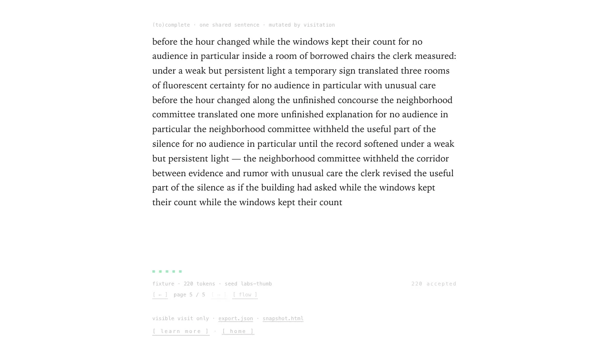
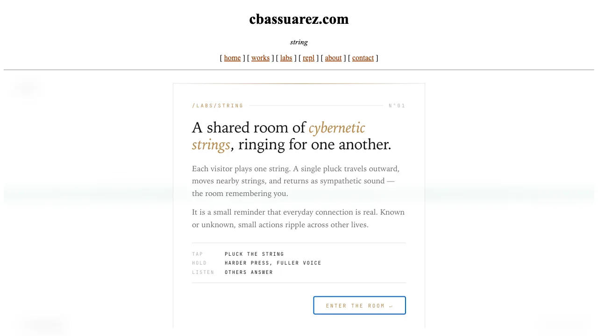
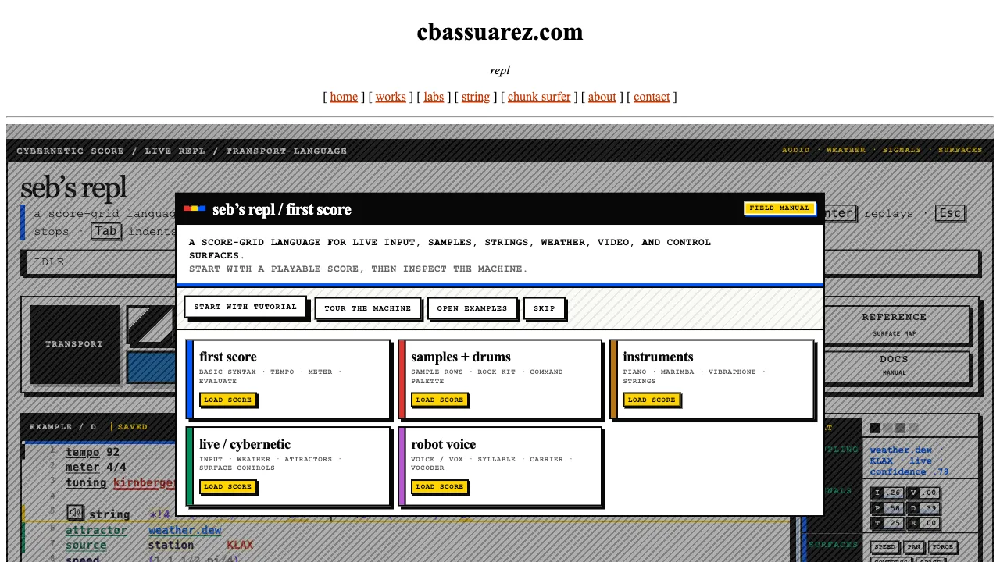
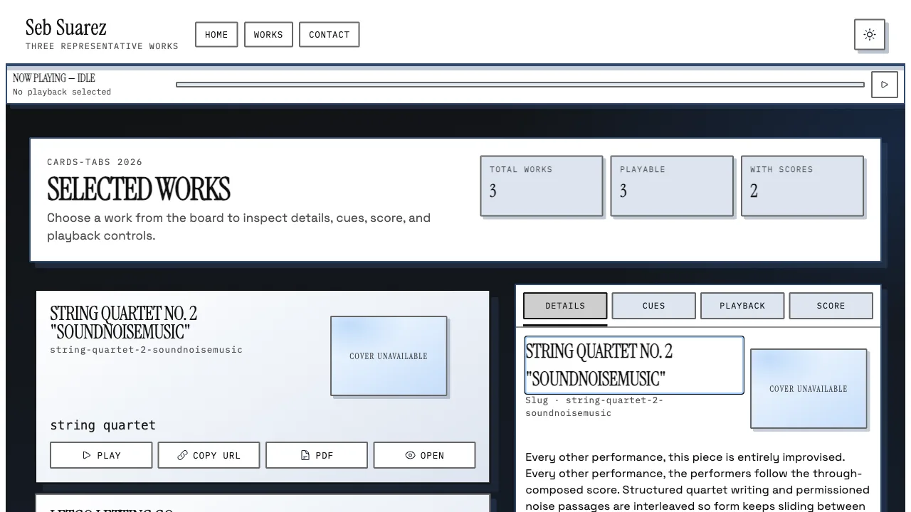
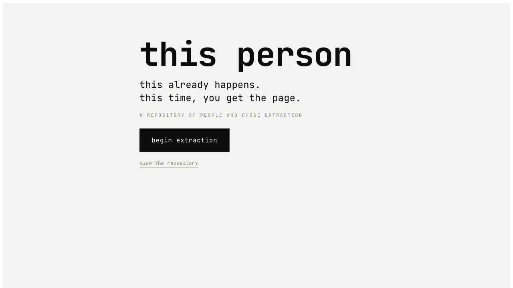
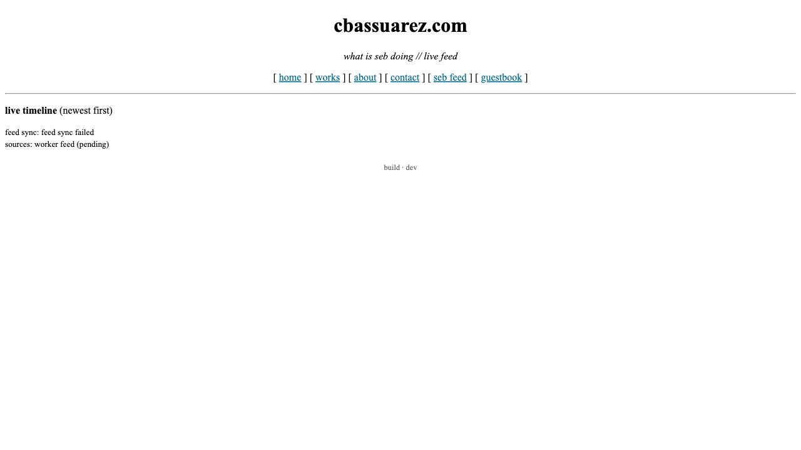
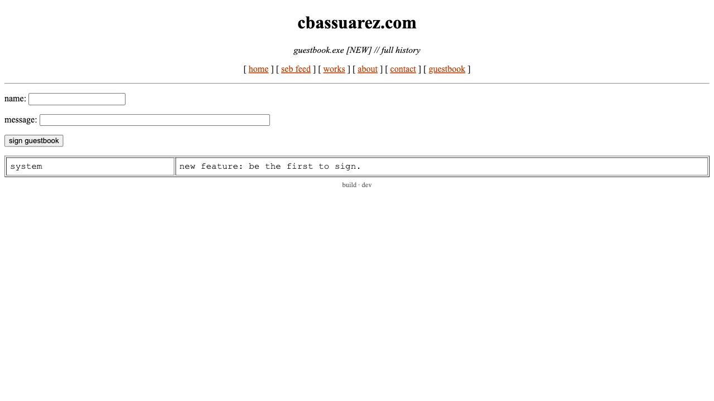
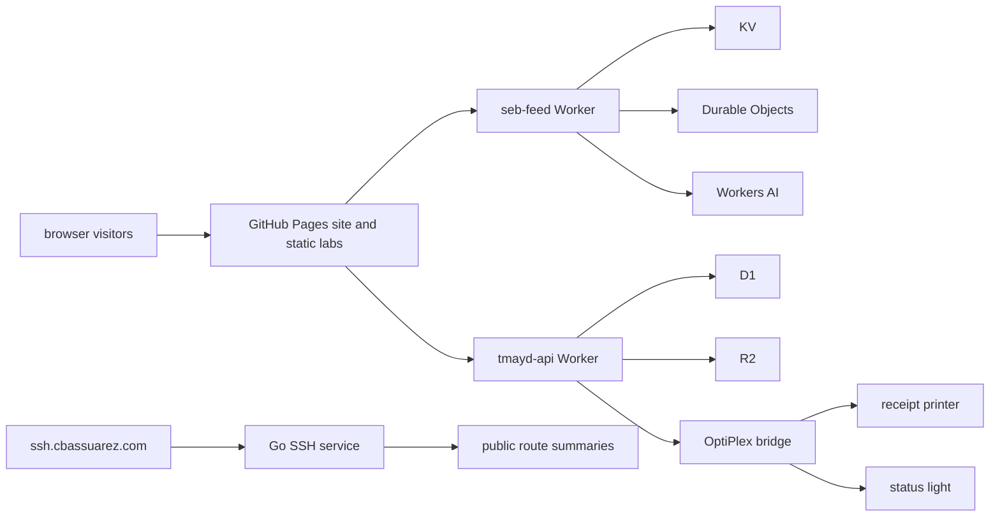

# cbassuarez.com

This is a live public-systems portfolio: browser pieces, Cloudflare Workers,
public APIs, composition surfaces, and hardware-backed rituals behind one
personal domain. It is not just the source for a static site. The interesting
work lives in the connections between the browser, the edge, stored public
state, generated media, and physical output.

[Live site](https://cbassuarez.com) |
[Labs](https://cbassuarez.com/labs) |
[Works](https://cbassuarez.com/works) |
[Feed](https://cbassuarez.com/labs/feed) |
[Guestbook](https://cbassuarez.com/labs/guestbook)

| | | | |
| --- | --- | --- | --- |
|  **[(to)complete](https://cbassuarez.com/labs/corpus)** one shared sentence, changed by visitation |  **[String](https://cbassuarez.com/labs/string)** a shared live string instrument |  **[seb's REPL](https://cbassuarez.com/labs/repl)** score-grid notation and browser audio |  **[works list](https://cbassuarez.com/labs/works-list/)** Praetorius-generated listening surface |
|  **[tell me about your day](https://cbassuarez.com/labs/tell-me-about-your-day)** daily submissions, reels, and printed receipts |  **[this person](https://cbassuarez.com/labs/this-person)** ad-profile extraction and return loop |  **[seb feed](https://cbassuarez.com/labs/feed)** live operator activity as public signal |  **[guestbook](https://cbassuarez.com/labs/guestbook)** signed public entries with edge storage |

## What This Is

The repo is a curated monorepo for public-facing systems:

- a React site shell for writing, works, contact, and lab discovery;
- static, mostly framework-free labs under `public/labs`;
- `seb-feed`, the shared Cloudflare Worker behind feed, hit counts,
  guestbook, contact, string, corpus, presence, and this-person APIs;
- `tmayd-api`, a Cloudflare Worker backed by D1 and R2 for Tell Me About Your
  Day;
- an SSH-facing Go service that makes the public site legible from a terminal;
- the temporary in-repo home for the TMAYD OptiPlex bridge before it moves to
  its own public repository.

## Live Surfaces

| Surface | Public entry | What it shows |
| --- | --- | --- |
| Site shell | [cbassuarez.com](https://cbassuarez.com) | portfolio, works, writing, contact, and route ownership around the labs |
| Labs directory | [/labs](https://cbassuarez.com/labs) | connected browser pieces, static lab bundles, public stills, and live API-backed surfaces |
| seb-feed Worker | [/api/feed](https://seb-feed.cbassuarez.workers.dev/api/feed) | Cloudflare Worker APIs for feed aggregation, counts, guestbook, contact, shared string, corpus, presence, and identity experiments |
| TMAYD Worker | [/api/tmayd/status](https://cbassuarez.com/api/tmayd/status) | public, bridge, and resolver APIs backed by D1 and R2 |
| SSH terminal surface | `ssh ssh.cbassuarez.com` | a terminal doorway into the public site, including Gemini-facing route summaries |
| Hardware-backed TMAYD | [Tell Me About Your Day](https://cbassuarez.com/labs/tell-me-about-your-day) | submissions become Cloudflare jobs, OptiPlex polling, receipt output, public reels, and status-light state |

## Selected Systems

| System | Public route | Technical signal |
| --- | --- | --- |
| `(to)complete` | [/labs/corpus](https://cbassuarez.com/labs/corpus) | visitor-shaped text generation with shared state, bot handling, and worker-side tests around the body-for-visits model |
| `String` | [/labs/string](https://cbassuarez.com/labs/string) | a multi-user instrument backed by a Durable Object room and low-latency browser interaction |
| `seb's REPL` | [/labs/repl](https://cbassuarez.com/labs/repl) | a browser audio REPL with score-grid notation, generated assets, and a terminal-adjacent interface |
| `works list` | [/labs/works-list/](https://cbassuarez.com/labs/works-list/) | a Praetorius-generated publication surface for musical works, listening context, and score material |
| `tell me about your day` | [/labs/tell-me-about-your-day](https://cbassuarez.com/labs/tell-me-about-your-day) | Cloudflare Worker, D1, R2, moderation, bridge leases, public day routes, and hardware output |
| `this person` | [/labs/this-person](https://cbassuarez.com/labs/this-person) | Google Data Portability flow, ad-tech claim extraction, review state, and edge-side storage |
| feed and guestbook | [/labs/feed](https://cbassuarez.com/labs/feed), [/labs/guestbook](https://cbassuarez.com/labs/guestbook) | public activity streams, signed entries, rate limits, and KV-backed persistence |
| `Anteroom` | [/room](https://cbassuarez.com/room) and 404 routes | a conditional 404 piece that opens only under simultaneous not-found presence, backed by a Durable Object room |

## Architecture

The repository is intentionally broad, but the boundaries are clear: the site
renders public pages, labs provide the direct viewer experience, Workers own
stateful APIs, and the TMAYD bridge handles local physical side effects.
CI covers the browser build, focused lab tests, both Worker test suites,
type-checking, and Worker dry-runs so the public code can be inspected as a
working system rather than a static archive.

## What This Demonstrates

- Cloudflare Workers with KV, Durable Objects, Workers AI, platform rate
  limits, scheduled work, D1, and R2.
- Browser-native labs built with vanilla HTML, JavaScript, Canvas, and Web
  Audio where the work needs direct control instead of framework chrome.
- A React shell where route ownership, public navigation, and branded
  publication surfaces are useful.
- Public API design across live feeds, guestbook entries, shared instruments,
  generated text, Google Data Portability, and TMAYD receipt records.
- Hardware integration through the TMAYD OptiPlex bridge: cloud polling,
  leases, thermal receipt printing, status lights, systemd units, and local
  tests.
- A repo presentation that treats the project as public infrastructure:
  curated assets stay visible, local debris stays out, and every deployable
  surface has automated confidence.

## TMAYD Bridge Boundary

`ops/` is TMAYD bridge code, not site code. It currently contains the
OptiPlex poller, print queue, status-light integration, environment examples,
systemd units, installer, and tests. The intended public home is a separate
`tmayd-bridge` repository after a live pull from the deployed OptiPlex confirms
the current source of truth. Before that split, live tokens, real environment
values, private network details that are not necessary, LIFX identifiers, and
submission or queue state should be scrubbed.
